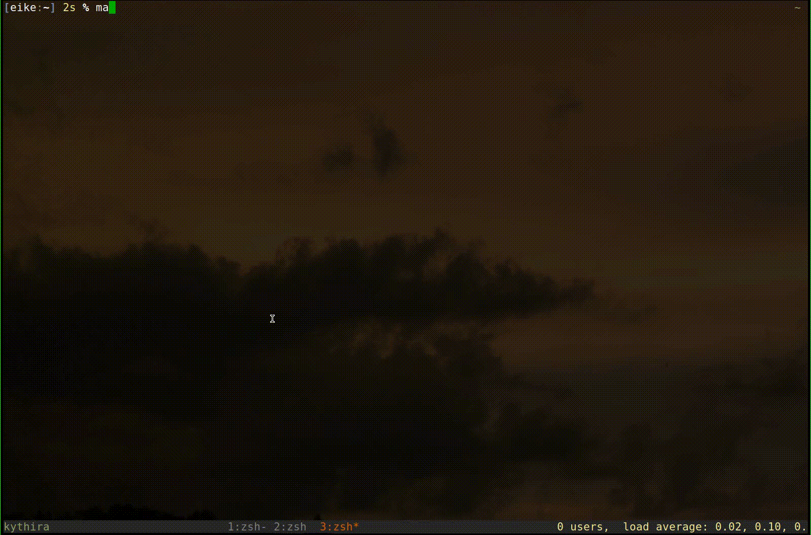

meth
====

The name “meth” is short for “mediathek”, a german online media portal.
Meth is a command line tool that allows to query, play and download
media from various state channels. It uses the files build by [ZDF
Mediathek](https://mediathekview.de). It cannot work without it.

Install
-------

Clone the repo and build it using [sbt](http://scala-sbt.org):

``` {.shell .rundoc-block rundoc-language="shell" rundoc-exports="code"}
sbt assembly
```

Then link the resulting executable `target/scala-2.12/meth-*` somewhere
in your `$PATH`. For example:

``` {.shell .rundoc-block rundoc-language="shell" rundoc-exports="both"}
ln -snf target/scala-2.12/meth-* ~/bin/meth
```

Usage
-----

There are 3 main commands: query, play and download. The `query` command
accepts a search string and prints the results. `Play` and `download`
use external tools `mpv` and `curl`, respectively.

### Query

The search syntax is quite simple. There are few basic forms:

1.  `key:value`
2.  `value`
3.  `dow:[sun|mon|tue|wed|thu|fri|sat]`
4.  `>X` or `<X`

The first matches when `value` is contained in the field named `key`.
Available keys are

-   station
-   subject
-   title
-   description
-   date
-   time
-   new

The second variant matches when `value` is contained in either `subject`
or `title`. Then it is possible to find shows aired on a specific
weekday. Form 4 can be used to match shows with a duration greater or
smaller `X` minutes.

These forms can be combined with `or`, `and` and `not`:

-   and: `(& ...)`
-   or: `(| ...)`
-   not: `-...`

The `-` in front of any term negates it. If many forms are separated by
space they are combined via `and`.

Example: `meth refugee '>10' dow:fri`

### Download

Instead of printing the results of a query, you can download these shows
using the download command. By default this calls out to the `curl`
program. This can be configured in the config file. See the
`reference.conf` file in `src/main/resources`.

The command allows to specify a filename using a pattern. The pattern is
simply a string with placeholders for data that is obtained from a show:

-   station
-   title
-   subject
-   year
-   month
-   day
-   hour
-   min
-   date
-   time

A placeholder is specified by putting it inside a `%[]`. Example:
`%[subject]-%[title]`. Note that any placeholder can evaluate to the
empty string if there is no value (i.e. if it is mispelled).

Quite often it is necessary to append or prepend text only if a
placeholder evaluates to non-empty. This can be achieved by this syntax:
`%[subject|prepend-%[subject]-append]`. This means “check if there is a
subject value and if so evaluate the pattern after |”.

The default pattern is: `%[subject|%[subject]-%]%[title]-%[date]`.

1.  thetvdb.com

    Note: this is a very experimental feature.

    It is possible to extend the set of placeholder variables by
    searching the site <http://thetvdb.com>. This allows to use
    placeholders in the output file pattern with the information from
    thetvdb.com. This can be useful to get e.g. the episode number to
    generate file names that can be recognized by certain players like
    kodi.

    For this to work, you must register at thetvdb.com and add the
    apikey to the config file. Also the series id of the series to
    search must be supplied to the download command. At last there is
    only one way to search: using the date of a show as the `firstAired`
    date. But this must be selected explicitely using the
    `--tvdb-firstaired` option.

    All placeholders are prefixed by `tvdb.`.

    Example: `s%[year]e%[tvdb.airedEpisodeNumber]_%[tvdb.episodeName]`

Configure
---------

You can configure it via a file `~/.config/meth/meth.conf`. Every
setting there can be overriden by setting a system property. Use the
environment variable `METH_JAVA_OPTS` for this.

Example: `METH_JAVA_OPTS=-Dmeth.directory=/tmp/meth meth`

The [Config](https://github.com/typesafe/config) library is used. Please
see its documentation fo find out more. Please see the default config at
`src/main/resources` for all options.

Example
-------


